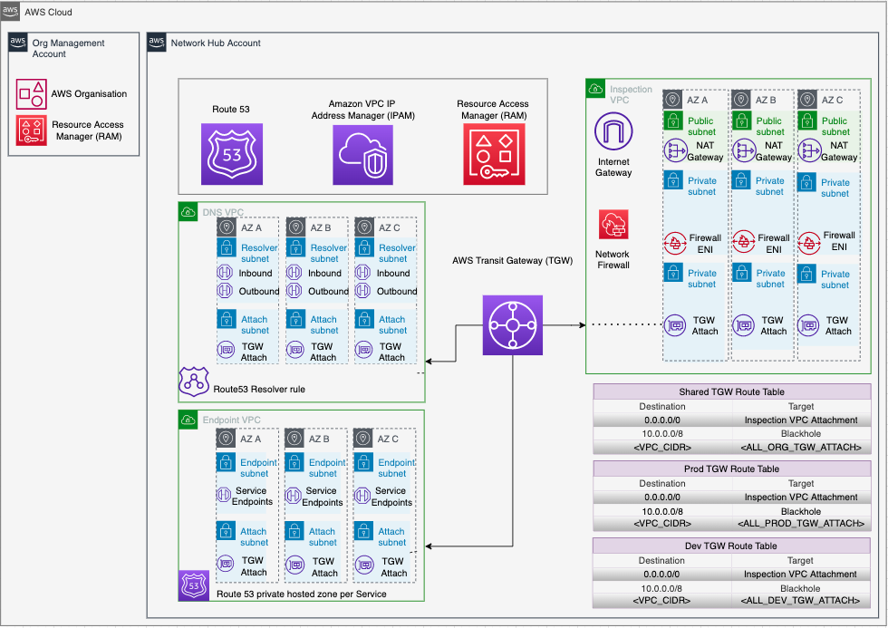
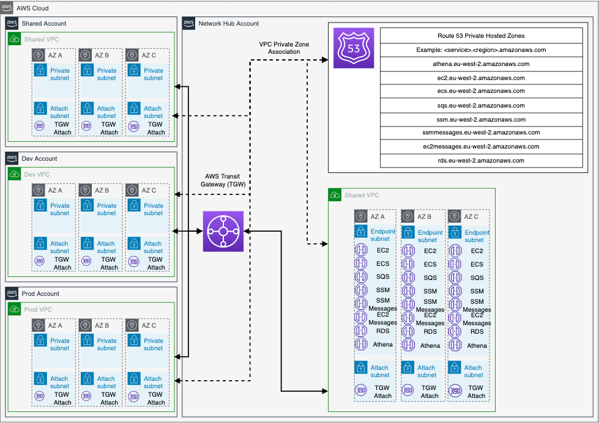

<!-- markdownlint-disable MD033 MD024 -->

# Network Hub Account with Terraform

This repository demonstrates a **scalable, segregated, secured** AWS network for **multi-account organizations**.
Using Transit Gateway to separate production, non-production and shared services traffic,
it deploys an advanced AWS networking pattern using centralized ingress and egress behind Network Firewall,
centralizes private VPC endpoints to share across all VPCs, and manages IP address allocation using Amazon VPC IPAM.

- Perfect for a central networking hub account, potentially alongside Account Factory for Terraform
- Solution itself can be deployed into nonprod, test and production deployments for safe iteration and testing.
- Written using clean, composable modules: the solution is easily extended and customised.

[Spoke VPCs for organization members can be created using the provided sister example in this repo.](/example-spoke-vpc/README.md)

The following resources will be deployed by this example:

- VPC Transit Gateway
- VPC Endpoints
- AWS Network Firewall
- Route 53 Resolver
- Amazon VPC IP Address Manager

The resources deployed and the architectural pattern they follow are provided for demonstration and
testing purposes but are based on and inspired by AWS best practice and articles.

## Table of Contents

- [Overview](#overview)
  - [Diagrams](#diagrams)
  - [References](#references)
- [Prerequisites](#prerequisites)
  - [Variables](#variables)
- [Quick Start](#quick-start)
  - [Deploy from client machine](#deploy-from-client-machine)
  - [Validate Deployment](#validate-deployment)
  - [Tagging](#tagging)
  - [clean Up](#clean-up)
- [Terraform Docs](#terraform-docs)
- [Security](#security)
- [License](#license)

## Overview

### Diagrams

Solution Diagram


Transit Gateway


VPC Endpoints


Network Firewall


Route 53 Resolver


### References

- <https://aws.amazon.com/blogs/architecture/field-notes-how-to-scale-your-networks-on-amazon-web-services/>
- <https://aws.amazon.com/blogs/industries/defining-an-aws-multi-account-strategy-for-a-digital-bank/>
- <https://aws.amazon.com/blogs/security/protect-your-remote-workforce-by-using-a-managed-dns-firewall-and-network-firewall/>
- <https://aws.amazon.com/blogs/architecture/field-notes-working-with-route-tables-in-aws-transit-gateway/>
- <https://docs.aws.amazon.com/vpc/latest/tgw/transit-gateway-isolated-shared.html>
- <https://aws.amazon.com/blogs/security/simplify-dns-management-in-a-multiaccount-environment-with-route-53-resolver/>

---

## Prerequisites

Minimal tooling is required for this solution. However, there are hard requirements around
AWS configuration.

### Tooling

- Terraform ~> 1.1
  - AWS provider >= 4.4.0
- AWS CLI
- Git CLI

### AWS account configuration

- AWS Organization
- Centralised network account
- IAM role with required permissions
- RAM sharing enabled for the Organisation

```bash
aws ram enable-sharing-with-aws-organization
```


**Troubleshooting tip**

If you experience any issue with the RAM share disable and re-enable RAM.

```bash
aws organizations disable-aws-service-access --service-principal ram.amazonaws.com
```

- IPAM delegated from the master account to the Centralised network account

```bash
aws ec2 enable-ipam-organization-admin-account \
    --delegated-admin-account-id <Network-Account-ID>
```


### Customisation

If you do not define a remote backend Terraform will use the local directory to store the backend files
including tfstate. Examples of how to customise the Terraform backend are included but commented out.
Usual caveats around safe storage of Terraform state must be considered.


Example GitLab HTTP backend for use with GitLab CI.


### Variables

| Type                           | Variable Name    | Description                                                      | Notes                                       |
| ------------------------------ | ---------------- | ---------------------------------------------------------------- | ------------------------------------------- |
| Global variables               | environment      | Environment to deploy into.                                      | Accepted values \* dev, test, preprod, prod |
|                                | aws_region       | Region to deploy in.                                             |                                             |
|                                | vpc_endpoints    | List of centralised VPC endpoints to be deployed                 |                                             |
| Environment specific variables | ipam_cidr        | CIDR to be allocated to the IP Address Manager                   |                                             |
|                                | tgw_route_tables | Transit Gateway Router Tables to create                          |                                             |
|                                | root_domain      | Root DNS domain to create private hosted zone and resolver rules |                                             |

**Input Variable -** _config.auto.tfvars_

```terraform
aws_region    = "eu-west-2"
vpc_endpoints = ["ec2", "rds", "sqs", "sns", "ssm", "logs", "ssmmessages", "ec2messages", "autoscaling", "ecs", "athena"]

env_config = {
  dev = {
    ipam_cidr        = "10.0.0.0/10"
    tgw_route_tables = ["prod", "dev", "shared"]
    root_domain      = "network-dev.internal"
  }
  test = {
    ipam_cidr        = "10.64.0.0/10"
    tgw_route_tables = ["prod", "dev", "shared"]
    root_domain      = "network-test.internal"
  }
  preprod = {
    ipam_cidr        = "10.128.0.0/10"
    tgw_route_tables = ["prod", "dev", "shared"]
    root_domain      = "network-preprod.internal"
  }
  prod = {
    ipam_cidr        = "10.192.0.0/10"
    tgw_route_tables = ["prod", "dev", "shared"]
    root_domain      = "network-prod.internal"
  }
}
```

---

## Quick Start

### Deploy from client machine

When deploying from your local machine having configured the **TF Backend** in the code you need to ensure you have access to read and write to the backend - possible backends include HTTP, Consul, Postgres, Artifactory, S3 or S3 + DynamoDB. We initialise the Terraform, complete the validate and format. Review the plan and then apply.

- `terraform init`
- `terraform validate`
- set environment for deployment
  - `export TF_VAR_environment="$ENV"`
  - `Set-Item -Path env:TF_VAR_environment -Value "$ENV"`
    (Possible $ENV values - `dev`, `test`, `preprod`, `prod`)
- `terraform plan`
- `terraform apply` **or** `terraform apply --auto-approve`

---

### Tagging

Tags are added to all AWS resources through use of the tag configuration of the AWS Provider.

As not all AWS resources support default tags passed from the provider (EC2 Auto-Scaling Group + Launch Template)
We pass the tags as a variable (Map(string) - these are defined in the root locals.tf file.


**Example Tags -** _locals.tf_

```terraform
tags = {
  Product    = "Network_Automation"
  Owner      = "GitHub"
  Project_ID = "12345"
}
```

### Clean Up

Remember to clean up after your work is complete. You can do that by doing `terraform destroy`.

Note that this command will delete all the resources previously created by Terraform.

## Terraform Docs

### Terraform Deployment

<!-- BEGIN_TF_DOCS -->

#### Requirements

| Name      | Version  |
| --------- | -------- |
| terraform | ~> 1.1   |
| aws       | >= 4.4.0 |

#### Providers

| Name | Version  |
| ---- | -------- |
| aws  | >= 4.4.0 |

#### Modules

| Name                 | Source                         | Version |
| -------------------- | ------------------------------ | ------- |
| dns                  | ./modules/dns                  | n/a     |
| ipam                 | ./modules/ipam                 | n/a     |
| network_firewall_vpc | ./modules/network_firewall_vpc | n/a     |
| tgw                  | ./modules/tgw                  | n/a     |
| vpc_endpoints        | ./modules/vpc_endpoints        | n/a     |

#### Resources

| Name                                                                                                                                                   | Type        |
| ------------------------------------------------------------------------------------------------------------------------------------------------------ | ----------- |
| [aws_iam_policy.central_network](https://registry.terraform.io/providers/hashicorp/aws/latest/docs/resources/iam_policy)                               | resource    |
| [aws_iam_policy_attachment.central_network](https://registry.terraform.io/providers/hashicorp/aws/latest/docs/resources/iam_policy_attachment)         | resource    |
| [aws_iam_role.central_network](https://registry.terraform.io/providers/hashicorp/aws/latest/docs/resources/iam_role)                                   | resource    |
| [aws_iam_role.flow_logs](https://registry.terraform.io/providers/hashicorp/aws/latest/docs/resources/iam_role)                                         | resource    |
| [aws_iam_role_policy.flow_logs](https://registry.terraform.io/providers/hashicorp/aws/latest/docs/resources/iam_role_policy)                           | resource    |
| [aws_kms_key.log_key](https://registry.terraform.io/providers/hashicorp/aws/latest/docs/resources/kms_key)                                             | resource    |
| [aws_availability_zones.available](https://registry.terraform.io/providers/hashicorp/aws/latest/docs/data-sources/availability_zones)                  | data source |
| [aws_caller_identity.current](https://registry.terraform.io/providers/hashicorp/aws/latest/docs/data-sources/caller_identity)                          | data source |
| [aws_iam_policy_document.policy_kms_logs_document](https://registry.terraform.io/providers/hashicorp/aws/latest/docs/data-sources/iam_policy_document) | data source |
| [aws_organizations_organization.main](https://registry.terraform.io/providers/hashicorp/aws/latest/docs/data-sources/organizations_organization)       | data source |

#### Inputs

| Name          | Description                                                       | Type                                                                                                                | Default | Required |
| ------------- | ----------------------------------------------------------------- | ------------------------------------------------------------------------------------------------------------------- | ------- | :------: |
| aws_region    | AWS region being deployed to                                      | `string`                                                                                                            | n/a     |   yes    |
| env_config    | Map of objects for per environment configuration                  | <pre>map(object({<br> ipam_cidr = string<br> tgw_route_tables = list(string)<br> root_domain = string<br> }))</pre> | n/a     |   yes    |
| environment   | Deployment environment passed as argument or environment variable | `string`                                                                                                            | n/a     |   yes    |
| vpc_endpoints | Which VPC endpoints to use                                        | `list(string)`                                                                                                      | n/a     |   yes    |

#### Outputs

No outputs.

<!-- END_TF_DOCS -->

### TGW Module

<!-- BEGIN_TF_TGW_DOCS -->

#### Requirements

No requirements.

#### Providers

| Name | Version |
| ---- | ------- |
| aws  | n/a     |

#### Modules

No modules.

#### Resources

| Name                                                                                                                                                       | Type     |
| ---------------------------------------------------------------------------------------------------------------------------------------------------------- | -------- |
| [aws_ec2_transit_gateway.org_tgw](https://registry.terraform.io/providers/hashicorp/aws/latest/docs/resources/ec2_transit_gateway)                         | resource |
| [aws_ec2_transit_gateway_route.blackhole_route](https://registry.terraform.io/providers/hashicorp/aws/latest/docs/resources/ec2_transit_gateway_route)     | resource |
| [aws_ec2_transit_gateway_route.default_route](https://registry.terraform.io/providers/hashicorp/aws/latest/docs/resources/ec2_transit_gateway_route)       | resource |
| [aws_ec2_transit_gateway_route_table.org_tgw](https://registry.terraform.io/providers/hashicorp/aws/latest/docs/resources/ec2_transit_gateway_route_table) | resource |
| [aws_ram_principal_association.org](https://registry.terraform.io/providers/hashicorp/aws/latest/docs/resources/ram_principal_association)                 | resource |
| [aws_ram_resource_association.tgw](https://registry.terraform.io/providers/hashicorp/aws/latest/docs/resources/ram_resource_association)                   | resource |
| [aws_ram_resource_share.main](https://registry.terraform.io/providers/hashicorp/aws/latest/docs/resources/ram_resource_share)                              | resource |

#### Inputs

| Name                  | Description                                                                                           | Type           | Default | Required |
| --------------------- | ----------------------------------------------------------------------------------------------------- | -------------- | ------- | :------: |
| az_names              | A list of the Availability Zone names available to the account                                        | `list(string)` | n/a     |   yes    |
| cidr                  | corporate cidr range for use with blackholing traffic between production and development environments | `string`       | n/a     |   yes    |
| environment           | Deployment environment passed as argument or environment variable                                     | `string`       | n/a     |   yes    |
| inspection_attachment | inspection vpc attachment for default route                                                           | `string`       | n/a     |   yes    |
| org_arn               | The ARN of the AWS Organization this account belongs to                                               | `string`       | n/a     |   yes    |
| tgw_route_tables      | List of route tables to create for the transit gateway                                                | `list(string)` | n/a     |   yes    |

#### Outputs

| Name            | Description                                              |
| --------------- | -------------------------------------------------------- |
| tgw             | tgw id for attachments                                   |
| tgw_route_table | map of route tables used for association and propagation |

<!-- END_TF_TGW_DOCS -->

### IPAM Module

<!-- BEGIN_TF_IPAM_DOCS -->

#### Requirements

No requirements.

#### Providers

| Name | Version |
| ---- | ------- |
| aws  | n/a     |

#### Modules

No modules.

#### Resources

| Name                                                                                                                                           | Type     |
| ---------------------------------------------------------------------------------------------------------------------------------------------- | -------- |
| [aws_ram_principal_association.org](https://registry.terraform.io/providers/hashicorp/aws/latest/docs/resources/ram_principal_association)     | resource |
| [aws_ram_resource_association.ipam](https://registry.terraform.io/providers/hashicorp/aws/latest/docs/resources/ram_resource_association)      | resource |
| [aws_ram_resource_share.main](https://registry.terraform.io/providers/hashicorp/aws/latest/docs/resources/ram_resource_share)                  | resource |
| [aws_ssm_parameter.ipam_pool_id](https://registry.terraform.io/providers/hashicorp/aws/latest/docs/resources/ssm_parameter)                    | resource |
| [aws_vpc_ipam.org_ipam](https://registry.terraform.io/providers/hashicorp/aws/latest/docs/resources/vpc_ipam)                                  | resource |
| [aws_vpc_ipam_pool.private_org_ipam_pool](https://registry.terraform.io/providers/hashicorp/aws/latest/docs/resources/vpc_ipam_pool)           | resource |
| [aws_vpc_ipam_pool_cidr.private_org_ipam_pool](https://registry.terraform.io/providers/hashicorp/aws/latest/docs/resources/vpc_ipam_pool_cidr) | resource |
| [aws_vpc_ipam_scope.private_org_ipam_scope](https://registry.terraform.io/providers/hashicorp/aws/latest/docs/resources/vpc_ipam_scope)        | resource |

#### Inputs

| Name       | Description                                             | Type     | Default | Required |
| ---------- | ------------------------------------------------------- | -------- | ------- | :------: |
| aws_region | AWS region being deployed to                            | `string` | n/a     |   yes    |
| ipam_cidr  | CIDR block assigned to IPAM pool                        | `string` | n/a     |   yes    |
| org_arn    | The ARN of the AWS Organization this account belongs to | `string` | n/a     |   yes    |

#### Outputs

| Name          | Description      |
| ------------- | ---------------- |
| org_ipam      | Org IPAM ID      |
| org_ipam_pool | Org IPAM pool ID |

<!-- END_TF_IPAM_DOCS -->

### VPC Endpoint Module

<!-- BEGIN_TF_VPCE_DOCS -->

#### Requirements

No requirements.

#### Providers

| Name | Version |
| ---- | ------- |
| aws  | n/a     |

#### Modules

No modules.

#### Resources

| Name                                                                                                                                                                              | Type     |
| --------------------------------------------------------------------------------------------------------------------------------------------------------------------------------- | -------- |
| [aws_cloudwatch_log_group.flow_logs](https://registry.terraform.io/providers/hashicorp/aws/latest/docs/resources/cloudwatch_log_group)                                            | resource |
| [aws_default_security_group.default](https://registry.terraform.io/providers/hashicorp/aws/latest/docs/resources/default_security_group)                                          | resource |
| [aws_ec2_transit_gateway_route_table_association.shared](https://registry.terraform.io/providers/hashicorp/aws/latest/docs/resources/ec2_transit_gateway_route_table_association) | resource |
| [aws_ec2_transit_gateway_route_table_propagation.org](https://registry.terraform.io/providers/hashicorp/aws/latest/docs/resources/ec2_transit_gateway_route_table_propagation)    | resource |
| [aws_ec2_transit_gateway_vpc_attachment.vpc_endpoint](https://registry.terraform.io/providers/hashicorp/aws/latest/docs/resources/ec2_transit_gateway_vpc_attachment)             | resource |
| [aws_flow_log.vpc](https://registry.terraform.io/providers/hashicorp/aws/latest/docs/resources/flow_log)                                                                          | resource |
| [aws_route.default_route](https://registry.terraform.io/providers/hashicorp/aws/latest/docs/resources/route)                                                                      | resource |
| [aws_route.default_route_ipv6](https://registry.terraform.io/providers/hashicorp/aws/latest/docs/resources/route)                                                                 | resource |
| [aws_route53_record.dev_ns](https://registry.terraform.io/providers/hashicorp/aws/latest/docs/resources/route53_record)                                                           | resource |
| [aws_route53_zone.interface_phz](https://registry.terraform.io/providers/hashicorp/aws/latest/docs/resources/route53_zone)                                                        | resource |
| [aws_route_table.endpoint_vpc](https://registry.terraform.io/providers/hashicorp/aws/latest/docs/resources/route_table)                                                           | resource |
| [aws_route_table_association.privatesubnet](https://registry.terraform.io/providers/hashicorp/aws/latest/docs/resources/route_table_association)                                  | resource |
| [aws_security_group.allow_vpc_endpoint](https://registry.terraform.io/providers/hashicorp/aws/latest/docs/resources/security_group)                                               | resource |
| [aws_security_group_rule.org_cidr](https://registry.terraform.io/providers/hashicorp/aws/latest/docs/resources/security_group_rule)                                               | resource |
| [aws_subnet.privatesubnet](https://registry.terraform.io/providers/hashicorp/aws/latest/docs/resources/subnet)                                                                    | resource |
| [aws_vpc.endpoint_vpc](https://registry.terraform.io/providers/hashicorp/aws/latest/docs/resources/vpc)                                                                           | resource |
| [aws_vpc_endpoint.interface](https://registry.terraform.io/providers/hashicorp/aws/latest/docs/resources/vpc_endpoint)                                                            | resource |
| [aws_vpc_dhcp_options.endpoint_vpc](https://registry.terraform.io/providers/hashicorp/aws/latest/docs/resources/vpc_dhcp_options)                                                 | resource |
| [aws_vpc_dhcp_options_association.endpoint_vpc](https://registry.terraform.io/providers/hashicorp/aws/latest/docs/resources/vpc_dhcp_options_association)                         | resource |

#### Inputs

| Name                | Description                                                                                           | Type           | Default | Required |
| ------------------- | ----------------------------------------------------------------------------------------------------- | -------------- | ------- | :------: |
| az_names            | A list of the Availability Zone names available to the account                                        | `list(string)` | n/a     |   yes    |
| cidr                | corporate cidr range for use with blackholing traffic between production and development environments | `string`       | n/a     |   yes    |
| environment         | Deployment environment passed as argument or environment variable                                     | `string`       | n/a     |   yes    |
| iam_role_arn        | iam role to allow vpc flow logs to write to cloudwatch                                                | `string`       | n/a     |   yes    |
| interface_endpoints | object representing the region and services to create interface endpoints for                         | `map(string)`  | n/a     |   yes    |
| kms_key_id          | vpc flow logs kms key to encrypt logs                                                                 | `string`       | n/a     |   yes    |
| org_ipam_pool       | IPAM pool ID to allocate CIDR space                                                                   | `string`       | n/a     |   yes    |
| tgw                 | TGW route tables for VPC attachment                                                                   | `string`       | n/a     |   yes    |
| tgw_route_tables    | TGW route tables for VPC association and propagation                                                  | `map(string)`  | n/a     |   yes    |

#### Outputs

No outputs.

<!-- END_TF_VPCE_DOCS -->

### DNS Module

<!-- BEGIN_TF_DNS_DOCS -->

#### Requirements

No requirements.

#### Providers

| Name | Version |
| ---- | ------- |
| aws  | n/a     |

#### Modules

No modules.

#### Resources

| Name                                                                                                                                                                              | Type     |
| --------------------------------------------------------------------------------------------------------------------------------------------------------------------------------- | -------- |
| [aws_cloudwatch_log_group.flow_logs](https://registry.terraform.io/providers/hashicorp/aws/latest/docs/resources/cloudwatch_log_group)                                            | resource |
| [aws_default_security_group.default](https://registry.terraform.io/providers/hashicorp/aws/latest/docs/resources/default_security_group)                                          | resource |
| [aws_ec2_transit_gateway_route_table_association.shared](https://registry.terraform.io/providers/hashicorp/aws/latest/docs/resources/ec2_transit_gateway_route_table_association) | resource |
| [aws_ec2_transit_gateway_route_table_propagation.org](https://registry.terraform.io/providers/hashicorp/aws/latest/docs/resources/ec2_transit_gateway_route_table_propagation)    | resource |
| [aws_ec2_transit_gateway_vpc_attachment.vpc_dns](https://registry.terraform.io/providers/hashicorp/aws/latest/docs/resources/ec2_transit_gateway_vpc_attachment)                  | resource |
| [aws_flow_log.vpc](https://registry.terraform.io/providers/hashicorp/aws/latest/docs/resources/flow_log)                                                                          | resource |
| [aws_ram_principal_association.org](https://registry.terraform.io/providers/hashicorp/aws/latest/docs/resources/ram_principal_association)                                        | resource |
| [aws_ram_resource_association.r53r](https://registry.terraform.io/providers/hashicorp/aws/latest/docs/resources/ram_resource_association)                                         | resource |
| [aws_ram_resource_share.main](https://registry.terraform.io/providers/hashicorp/aws/latest/docs/resources/ram_resource_share)                                                     | resource |
| [aws_route.default_route](https://registry.terraform.io/providers/hashicorp/aws/latest/docs/resources/route)                                                                      | resource |
| [aws_route.default_route_ipv6](https://registry.terraform.io/providers/hashicorp/aws/latest/docs/resources/route)                                                                 | resource |
| [aws_route53_resolver_endpoint.inbound](https://registry.terraform.io/providers/hashicorp/aws/latest/docs/resources/route53_resolver_endpoint)                                    | resource |
| [aws_route53_resolver_endpoint.outbound](https://registry.terraform.io/providers/hashicorp/aws/latest/docs/resources/route53_resolver_endpoint)                                   | resource |
| [aws_route53_resolver_rule.fwd](https://registry.terraform.io/providers/hashicorp/aws/latest/docs/resources/route53_resolver_rule)                                                | resource |
| [aws_route53_resolver_rule_association.org_dns](https://registry.terraform.io/providers/hashicorp/aws/latest/docs/resources/route53_resolver_rule_association)                    | resource |
| [aws_route53_zone.root_private](https://registry.terraform.io/providers/hashicorp/aws/latest/docs/resources/route53_zone)                                                         | resource |
| [aws_route_table.dns_vpc](https://registry.terraform.io/providers/hashicorp/aws/latest/docs/resources/route_table)                                                                | resource |
| [aws_route_table_association.privatesubnet](https://registry.terraform.io/providers/hashicorp/aws/latest/docs/resources/route_table_association)                                  | resource |
| [aws_security_group.allow_dns](https://registry.terraform.io/providers/hashicorp/aws/latest/docs/resources/security_group)                                                        | resource |
| [aws_security_group_rule.org_cidr](https://registry.terraform.io/providers/hashicorp/aws/latest/docs/resources/security_group_rule)                                               | resource |
| [aws_subnet.privatesubnet](https://registry.terraform.io/providers/hashicorp/aws/latest/docs/resources/subnet)                                                                    | resource |
| [aws_vpc.dns_vpc](https://registry.terraform.io/providers/hashicorp/aws/latest/docs/resources/vpc)                                                                                | resource |
| [aws_vpc_dhcp_options.dns_vpc](https://registry.terraform.io/providers/hashicorp/aws/latest/docs/resources/vpc_dhcp_options)                                                      | resource |
| [aws_vpc_dhcp_options_association.dns_vpc](https://registry.terraform.io/providers/hashicorp/aws/latest/docs/resources/vpc_dhcp_options_association)                              | resource |

#### Inputs

| Name                | Description                                                                                           | Type           | Default | Required |
| ------------------- | ----------------------------------------------------------------------------------------------------- | -------------- | ------- | :------: |
| az_names            | A list of the Availability Zone names available to the account                                        | `list(string)` | n/a     |   yes    |
| cidr                | corporate cidr range for use with blackholing traffic between production and development environments | `string`       | n/a     |   yes    |
| environment         | Deployment environment passed as argument or environment variable                                     | `string`       | n/a     |   yes    |
| iam_role_arn        | iam role to allow vpc flow logs to write to cloudwatch                                                | `string`       | n/a     |   yes    |
| interface_endpoints | object representing the region and services to create interface endpoints for                         | `map(string)`  | n/a     |   yes    |
| kms_key_id          | vpc flow logs kms key to encrypt logs                                                                 | `string`       | n/a     |   yes    |
| org_arn             | The ARN of the AWS Organization this account belongs to                                               | `string`       | n/a     |   yes    |
| org_ipam_pool       | IPAM pool ID to allocate CIDR space                                                                   | `string`       | n/a     |   yes    |
| root_domain         | root domain for private hosted zone delegation                                                        | `string`       | n/a     |   yes    |
| tgw                 | TGW route tables for VPC attachment                                                                   | `string`       | n/a     |   yes    |
| tgw_route_tables    | TGW route tables for VPC association and propagation                                                  | `map(string)`  | n/a     |   yes    |

#### Outputs

No outputs.

<!-- END_TF_DNS_DOCS -->

### Network Firewall Module

<!-- BEGIN_TF_NFW_DOCS -->

#### Requirements

No requirements.

#### Providers

| Name | Version |
| ---- | ------- |
| aws  | n/a     |

#### Modules

No modules.

#### Resources

| Name                                                                                                                                                                                                        | Type        |
| ----------------------------------------------------------------------------------------------------------------------------------------------------------------------------------------------------------- | ----------- |
| [aws_cloudwatch_log_group.flow_logs](https://registry.terraform.io/providers/hashicorp/aws/latest/docs/resources/cloudwatch_log_group)                                                                      | resource    |
| [aws_cloudwatch_log_group.network_firewall_alert_log_group](https://registry.terraform.io/providers/hashicorp/aws/latest/docs/resources/cloudwatch_log_group)                                               | resource    |
| [aws_cloudwatch_log_group.network_firewall_flow_log_group](https://registry.terraform.io/providers/hashicorp/aws/latest/docs/resources/cloudwatch_log_group)                                                | resource    |
| [aws_default_security_group.default](https://registry.terraform.io/providers/hashicorp/aws/latest/docs/resources/default_security_group)                                                                    | resource    |
| [aws_ec2_transit_gateway_route_table_association.shared](https://registry.terraform.io/providers/hashicorp/aws/latest/docs/resources/ec2_transit_gateway_route_table_association)                           | resource    |
| [aws_ec2_transit_gateway_route_table_propagation.org](https://registry.terraform.io/providers/hashicorp/aws/latest/docs/resources/ec2_transit_gateway_route_table_propagation)                              | resource    |
| [aws_ec2_transit_gateway_vpc_attachment.vpc_inspection](https://registry.terraform.io/providers/hashicorp/aws/latest/docs/resources/ec2_transit_gateway_vpc_attachment)                                     | resource    |
| [aws_eip.internet_vpc_nat](https://registry.terraform.io/providers/hashicorp/aws/latest/docs/resources/eip)                                                                                                 | resource    |
| [aws_flow_log.vpc](https://registry.terraform.io/providers/hashicorp/aws/latest/docs/resources/flow_log)                                                                                                    | resource    |
| [aws_iam_role.flow_logs](https://registry.terraform.io/providers/hashicorp/aws/latest/docs/resources/iam_role)                                                                                              | resource    |
| [aws_iam_role_policy.flow_logs](https://registry.terraform.io/providers/hashicorp/aws/latest/docs/resources/iam_role_policy)                                                                                | resource    |
| [aws_internet_gateway.igw](https://registry.terraform.io/providers/hashicorp/aws/latest/docs/resources/internet_gateway)                                                                                    | resource    |
| [aws_egress_only_internet_gateway.eigw](https://registry.terraform.io/providers/hashicorp/aws/latest/docs/resources/egress_only_internet_gateway)                                                           | resource    |
| [aws_kms_key.log_key](https://registry.terraform.io/providers/hashicorp/aws/latest/docs/resources/kms_key)                                                                                                  | resource    |
| [aws_nat_gateway.internet](https://registry.terraform.io/providers/hashicorp/aws/latest/docs/resources/nat_gateway)                                                                                         | resource    |
| [aws_networkfirewall_firewall.inspection_vpc_network_firewall](https://registry.terraform.io/providers/hashicorp/aws/latest/docs/resources/networkfirewall_firewall)                                        | resource    |
| [aws_networkfirewall_firewall_policy.anfw_policy](https://registry.terraform.io/providers/hashicorp/aws/latest/docs/resources/networkfirewall_firewall_policy)                                              | resource    |
| [aws_networkfirewall_logging_configuration.network_firewall_alert_logging_configuration](https://registry.terraform.io/providers/hashicorp/aws/latest/docs/resources/networkfirewall_logging_configuration) | resource    |
| [aws_networkfirewall_rule_group.block_domains](https://registry.terraform.io/providers/hashicorp/aws/latest/docs/resources/networkfirewall_rule_group)                                                      | resource    |
| [aws_route.default_route](https://registry.terraform.io/providers/hashicorp/aws/latest/docs/resources/route)                                                                                                | resource    |
| [aws_route.default_route_ipv6](https://registry.terraform.io/providers/hashicorp/aws/latest/docs/resources/route)                                                                                           | resource    |
| [aws_route.egress_route](https://registry.terraform.io/providers/hashicorp/aws/latest/docs/resources/route)                                                                                                 | resource    |
| [aws_route.egress_route_ipv6](https://registry.terraform.io/providers/hashicorp/aws/latest/docs/resources/route)                                                                                            | resource    |
| [aws_route.ingress_route](https://registry.terraform.io/providers/hashicorp/aws/latest/docs/resources/route)                                                                                                | resource    |
| [aws_route.inspection_route](https://registry.terraform.io/providers/hashicorp/aws/latest/docs/resources/route)                                                                                             | resource    |
| [aws_route.inspection_route_ipv6](https://registry.terraform.io/providers/hashicorp/aws/latest/docs/resources/route)                                                                                        | resource    |
| [aws_route.inspection_route_natgw_ipv6](https://registry.terraform.io/providers/hashicorp/aws/latest/docs/resources/route)                                                                                  | resource    |
| [aws_route.internal_route](https://registry.terraform.io/providers/hashicorp/aws/latest/docs/resources/route)                                                                                               | resource    |
| [aws_route_table.attachment](https://registry.terraform.io/providers/hashicorp/aws/latest/docs/resources/route_table)                                                                                       | resource    |
| [aws_route_table.inspection](https://registry.terraform.io/providers/hashicorp/aws/latest/docs/resources/route_table)                                                                                       | resource    |
| [aws_route_table.internet](https://registry.terraform.io/providers/hashicorp/aws/latest/docs/resources/route_table)                                                                                         | resource    |
| [aws_route_table_association.attachment_subnet_rt_association](https://registry.terraform.io/providers/hashicorp/aws/latest/docs/resources/route_table_association)                                         | resource    |
| [aws_route_table_association.inspection_subnet](https://registry.terraform.io/providers/hashicorp/aws/latest/docs/resources/route_table_association)                                                        | resource    |
| [aws_route_table_association.internet_subnet](https://registry.terraform.io/providers/hashicorp/aws/latest/docs/resources/route_table_association)                                                          | resource    |
| [aws_subnet.attachment_subnet](https://registry.terraform.io/providers/hashicorp/aws/latest/docs/resources/subnet)                                                                                          | resource    |
| [aws_subnet.inspection_subnet](https://registry.terraform.io/providers/hashicorp/aws/latest/docs/resources/subnet)                                                                                          | resource    |
| [aws_subnet.internet_subnet](https://registry.terraform.io/providers/hashicorp/aws/latest/docs/resources/subnet)                                                                                            | resource    |
| [aws_vpc.inspection_vpc](https://registry.terraform.io/providers/hashicorp/aws/latest/docs/resources/vpc)                                                                                                   | resource    |
| [aws_vpc_dhcp_options.endpoint_vpc](https://registry.terraform.io/providers/hashicorp/aws/latest/docs/resources/vpc_dhcp_options)                                                                           | resource    |
| [aws_vpc_dhcp_options_association.endpoint_vpc](https://registry.terraform.io/providers/hashicorp/aws/latest/docs/resources/vpc_dhcp_options_association)                                                   | resource    |
| [aws_caller_identity.current](https://registry.terraform.io/providers/hashicorp/aws/latest/docs/data-sources/caller_identity)                                                                               | data source |
| [aws_iam_policy_document.policy_kms_logs_document](https://registry.terraform.io/providers/hashicorp/aws/latest/docs/data-sources/iam_policy_document)                                                      | data source |

#### Inputs

| Name             | Description                                                                                           | Type           | Default | Required |
| ---------------- | ----------------------------------------------------------------------------------------------------- | -------------- | ------- | :------: |
| aws_region       | AWS region being deployed to                                                                          | `string`       | n/a     |   yes    |
| az_names         | A list of the Availability Zone names available to the account                                        | `list(string)` | n/a     |   yes    |
| cidr             | corporate cidr range for use with blackholing traffic between production and development environments | `string`       | n/a     |   yes    |
| environment      | Deployment environment passed as argument or environment variable                                     | `string`       | n/a     |   yes    |
| org_ipam_pool    | IPAM pool ID to allocate CIDR space                                                                   | `string`       | n/a     |   yes    |
| tgw              | TGW route tables for VPC attachment                                                                   | `string`       | n/a     |   yes    |
| tgw_route_tables | TGW route tables for VPC association and propagation                                                  | `map(string)`  | n/a     |   yes    |

#### Outputs

| Name                  | Description                                           |
| --------------------- | ----------------------------------------------------- |
| eni_map               | n/a                                                   |
| firewall_info         | Info of network fire for routing                      |
| inspection_attachment | inspection tgw attachment id for default route in tgw |
| route_table           | output route tables used for NFW                      |
| rt_map                | n/a                                                   |

<!-- END_TF_NFW_DOCS -->

## Security

See [CONTRIBUTING](CONTRIBUTING.md#security-issue-notifications) for more information.

## License

This library is licensed under the MIT-0 License. See the LICENSE file.
